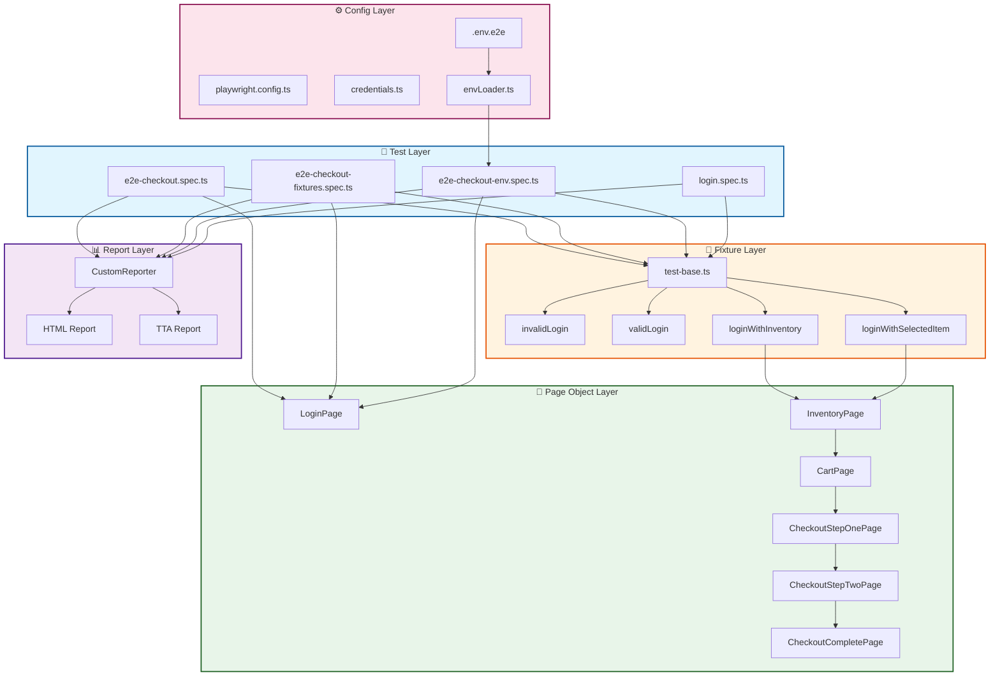
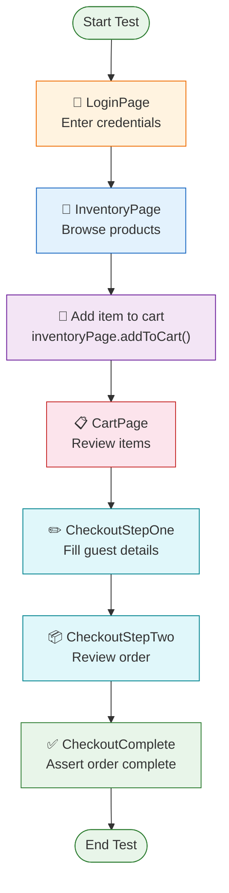
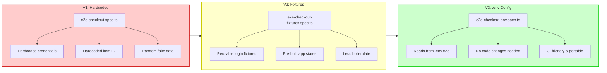

# AdvPlaywright2xFramework

An advanced Playwright 2.x test automation framework built with TypeScript, featuring Page Object Model (POM) design, custom reporting, API testing support, and data-driven testing capabilities.

## Features

- **TypeScript** - Type-safe test development
- **Page Object Model** - Maintainable and scalable test architecture
- **Custom Reporter** - Rich HTML report with real-time updates, test steps, screenshots, videos, and traces
- **AI-Powered Analysis** - AI Data tab, AI Verdict (RCA) for failures, and Flaky Test Analyzer
- **API Testing** - Built-in support for API test automation
- **Data Generation** - Faker.js integration for dynamic test data
- **Logging** - Winston logger for comprehensive test logs
- **Video & Trace Recording** - Automatic capture on test execution
- **Screenshot on Failure** - Automatic failure capture for debugging
- **Per-Step Screenshots (Optional)** - Capture screenshots after every `visualStep` when enabled via flag
- **Multi-browser Support** - Configurable for Chromium, Firefox, WebKit

## Project Structure

```
AdvPlaywright2xFramework/
├── src/
│   ├── ai/               # AI agents (RCA, Flaky Analyzer)
│   ├── api/              # API testing utilities and helpers
│   ├── config/           # Configuration files (credentials, etc.)
│   ├── fixtures/         # Test fixtures and setup
│   ├── pages/            # Page Object Models
│   │   ├── BasePage.ts
│   │   ├── LoginPage.ts
│   │   ├── InventoryPage.ts
│   │   ├── CartPage.ts
│   │   ├── CheckoutStepOnePage.ts
│   │   ├── CheckoutStepTwoPage.ts
│   │   ├── CheckoutCompletePage.ts
│   │   └── ItemDetailPage.ts
│   ├── testdata/         # Test data files (JSON, CSV, Excel)
│   │   ├── logintestdata.json
│   │   └── logintestdata.ts
│   ├── tests/            # Test specifications
│   │   ├── e2e/          # End-to-end tests
│   │   │   ├── e2e-checkout.spec.ts
│   │   │   ├── e2e-checkout-fixtures.spec.ts
│   │   │   └── e2e-checkout-env.spec.ts
│   │   └── login.spec.ts
│   └── utils/            # Utility functions
│       ├── CustomReporter.ts
│       ├── DataGenerator.ts
│       ├── envLoader.ts
│       ├── logger.ts
│       ├── UtilElementLocator.ts
│       └── VisualStep.ts
├── .github/              # GitHub workflows and templates
├── docs/                 # Documentation
├── learning/             # Learning & build records
├── rules/                # Coding rules and guidelines
├── playwright.config.ts  # Playwright configuration
├── package.json          # Dependencies and scripts
└── tsconfig.json         # TypeScript configuration
```

---

## Architecture Diagram



## Prerequisites

- Node.js (v16 or higher)
- npm or yarn

## Installation

1. Clone the repository:
   ```bash
   git clone https://github.com/rai01sumit-qa/AdvPlaywrigt2xFramework.git
   cd AdvPlaywright2xFramework
   ```

2. Install dependencies:
   ```bash
   npm install
   ```

3. Install Playwright browsers:
   ```bash
   npx playwright install
   ```

## Configuration

The framework uses `playwright.config.ts` for test configuration. Key settings include:

- **Test Directory**: `./src/tests`
- **Headless Mode**: Disabled (visible browser)
- **Screenshots**: Captured on failure
- **Video Recording**: Enabled for all tests
- **Trace Collection**: Enabled for all tests
- **Reporter**: List, HTML, and Custom TTA Reporter

### Custom Reporter Settings
The TTA custom reporter (`src/utils/CustomReporter.ts`) is pre-configured in `playwright.config.ts` and automatically:
- Copies screenshots, videos, and traces into `tta-report/`
- Generates a real-time updating HTML report
- Provides AI-powered analysis tabs (when API keys are configured)

### Per-Step Screenshots
The framework supports optional screenshot capture at the end of every `visualStep`. This is useful for debugging and detailed reporting, but is **disabled by default** to keep execution fast.

To enable per-step screenshots, set the environment variable:
```bash
ENABLE_STEP_SCREENSHOTS=true
```

When enabled, each step in the TTA HTML report will include a screenshot image.

## Running Tests

Run all tests:
```bash
npx playwright test
```

Run tests in headed mode:
```bash
npx playwright test --headed
```

Run specific test file:
```bash
npx playwright test login.spec.ts
npx playwright test e2e-checkout.spec.ts
npx playwright test e2e-checkout-fixtures.spec.ts
npx playwright test e2e-checkout-env.spec.ts
```

Run tests with debug mode:
```bash
npx playwright test --debug
```

Run tests with the TTA custom reporter only:
```bash
npx playwright test --reporter=src/utils/CustomReporter.ts
```

Run tests with per-step screenshots enabled:
```bash
# Windows PowerShell
$env:ENABLE_STEP_SCREENSHOTS="true"
npx playwright test

# macOS / Linux
ENABLE_STEP_SCREENSHOTS=true npx playwright test
```

### Checkout E2E Flow



## Test Data

Login credentials are stored in `src/testdata/logintestdata.json` and consumed by both fixtures and specs:

| Username | Password | Type |
|----------|----------|------|
| `standard_user` | `tta_secret` | Valid |
| `locked_out_user` | `tta_secret` | Invalid (blocked) |
| `problem_user` | `tta_secret` | Valid |
| `performance_glitch_user` | `tta_secret` | Valid |
| `error_user` | `tta_secret` | Valid |
| `visual_user` | `tta_secret` | Valid |

## Test Fixtures

The framework provides reusable Playwright fixtures in `src/fixtures/test-base.ts` to speed up test setup and reduce boilerplate:

| Fixture | Description | Use When |
|---------|-------------|----------|
| `invalidLogin` | Attempts login with `locked_out_user` and asserts the error banner is visible. | Testing negative login flows or proving unauthorised users cannot reach protected pages. |
| `validLogin` | Logs in as `standard_user` and hands over an authenticated `LoginPage`. | Any test that needs to start already logged in. |
| `loginWithInventory` | Builds on `validLogin`, navigates to inventory, and asserts it is loaded. | Tests that operate directly on the inventory page. |
| `loginWithSelectedItem` | Builds on `loginWithInventory`, adds `test-allthethings-tshirt-red` to the cart. | Tests that need an item pre-loaded in the cart (fastest checkout setup). |

### Example — Using Fixtures in a Spec

```typescript
import { test, expect } from '@fixtures/test-base';

test('checkout with pre-selected item', async ({
    loginWithSelectedItem,
    cartPage,
    checkoutStepOnePage,
    checkoutStepTwoPage,
    checkoutCompletePage,
}) => {
    // Item is already in the cart — just proceed to checkout
    await cartPage.open();
    await cartPage.checkout();
    // ... fill details and finish
});
```

See `src/tests/e2e/e2e-checkout-fixtures.spec.ts` for a full demonstration of all four fixtures.

---

## Checkout Test Evolution

The framework includes **three variants** of the same checkout flow, demonstrating progressive test design patterns:



| Version | Approach | Best For |
|---------|----------|----------|
| **V1** | Hardcoded values | Learning the flow, quick prototypes |
| **V2** | Fixtures | Reusable setup, DRY tests |
| **V3** | `.env` driven | Environment-specific configs, CI/CD, secrets management |

## Viewing Reports

### TTA Custom HTML Report
After each run, the custom report is generated in the `tta-report/` folder:
- `tta-report/index.html` — redirects to the latest report
- `tta-report/report_YYYYMMDD_HHMMSS.html` — individual run report
- `tta-report/history.html` — list of all past reports

Open the report directly:
```bash
start tta-report/index.html        # Windows
open tta-report/index.html         # macOS
```

The report includes:
- **Stats Dashboard** — total, passed, failed, skipped, pass rate, duration
- **Test Results Table** — sortable, filterable by priority and status
- **Test Detail Panel** — click any test name to expand: errors, logs, steps, screenshots, videos, traces
- **AI Data Tab** — AI-generated test datasets
- **AI Verdict Tab** — root-cause analysis for failed tests
- **Flaky Tab** — cross-build flaky test comparison

### Playwright HTML Report
```bash
npx playwright show-report
```

### Viewing Traces
Traces are saved to `tta-report/traces/trace_N.zip`. View them interactively:
```bash
npx playwright show-trace tta-report/traces/trace_1.zip
```
Or drag & drop the zip file onto [trace.playwright.dev](https://trace.playwright.dev).

### Viewing Videos
Videos are saved to:
- `test-results/**/video.webm` (Playwright default)
- `tta-report/videos/video_N.webm` (TTA custom reporter)

They can be played directly in the TTA report detail panel, the Playwright HTML report, or opened in any video player.

```bash
npx playwright show-report
```

Or open the video file directly:
```bash
start test-results/**/video.webm   # Windows
open test-results/**/video.webm    # macOS
```

## Key Dependencies

| Package | Version | Purpose |
|---------|---------|---------|
| @faker-js/faker | ^10.6.0 | Dynamic test data generation |
| allure-playwright | ^3.11.0 | Allure reporting integration |
| winston | ^3.19.0 | Logging utility |
| dotenv | ^17.4.2 | Environment variable management |
| ajv | ^8.20.0 | JSON schema validation |
| csv-parse | ^7.0.2 | CSV data parsing |
| xlsx | ^0.18.5 | Excel data handling |

## Environment Variables

Create a `.env` file in the root directory for environment-specific configurations:

```env
BASE_URL=your_application_url
API_BASE_URL=your_api_url
```

### Checkout Test Variables

The following variables are used by `e2e-checkout-env.spec.ts`:

| Variable | Description | Default |
|----------|-------------|---------|
| `STANDARD_USER` | Username for checkout tests | `standard_user` |
| `TTA_SECRET` | Password for checkout tests | `tta_secret` |
| `CHECKOUT_ITEM_ID` | Product ID to add to cart | `test-allthethings-tshirt-red` |
| `CHECKOUT_FIRST_NAME` | First name for checkout form | `Pramod` |
| `CHECKOUT_LAST_NAME` | Last name for checkout form | `Dutta` |
| `CHECKOUT_POSTAL_CODE` | Postal code for checkout form | `560001` |

### How `.env` Integration Works

```mermaid
flowchart LR
    subgraph EnvFile["📝 .env.e2e"]
        E1["STANDARD_USER"]
        E2["TTA_SECRET"]
        E3["CHECKOUT_ITEM_ID"]
        E4["CHECKOUT_FIRST_NAME"]
    end

    subgraph Loader["🔍 envLoader.ts"]
        L1["Reads .env file"]
        L2["Parses key=value pairs"]
    end

    subgraph Memory["🧠 process.env"]
        M1["process.env.STANDARD_USER"]
        M2["process.env.TTA_SECRET"]
        M3["process.env.CHECKOUT_ITEM_ID"]
    end

    subgraph Test["🧪 e2e-checkout-env.spec.ts"]
        T1["const USERNAME = process.env.STANDARD_USER \|\| 'fallback'"]
        T2["Uses values in test steps"]
    end

    EnvFile --> Loader
    Loader --> Memory
    Memory --> Test

    style EnvFile fill:#e8f5e9,stroke:#2e7d32,stroke-width:2px
    style Loader fill:#fff3e0,stroke:#ef6c00,stroke-width:2px
    style Memory fill:#e3f2fd,stroke:#1565c0,stroke-width:2px
    style Test fill:#fce4ec,stroke:#c62828,stroke-width:2px
```



**Key points:**
- `envLoader.ts` wraps `dotenv` to load any `.env` file by name
- The spec calls `loadEnvFile('.env.e2e')` **before** other imports
- Fallback defaults (`|| 'default'`) allow local dev without the file
- CI strict mode fails fast if required variables are missing

### Optional Flags

| Variable | Values | Description |
|----------|--------|-------------|
| `ENABLE_STEP_SCREENSHOTS` | `true` / `1` | Capture a screenshot after every `visualStep` and attach it to the TTA HTML report. Disabled by default. |
| `TEST_ENV` | any string | Environment label shown in the report (default: `UAT`). |
| `TEST_AUTHOR` | any string | Author name shown in the report table (default: `TTA-QA`). |

## Contributing

1. Fork the repository
2. Create a feature branch (`git checkout -b feature/amazing-feature`)
3. Commit your changes (`git commit -m 'Add amazing feature'`)
4. Push to the branch (`git push origin feature/amazing-feature`)
5. Open a Pull Request

## License

This project is licensed under the ISC License.
